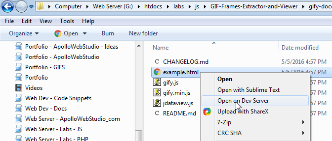

# Open File in Web Browser on Dev Server from Windows File Explorer Context Menu

This Windows Registry file and AutoHotKey Application script will add a new Context menu item to the Windows Explorer window when viewing file.  Clicking the menu item will open the file in your default Web Browser and replace the Windows File Path with the URL of your Dev Server and then append the file path onto the Dev Server URL.

## Example of what the AHK program and Windows Registry entry do:

File Path to a file on Windows located at:  

    E:\Server\htdocs\Labs\javascript\socialbuttons\socialable

is changed to

    http://localhost/Labs/javascript/socialbuttons/socialable

so you can see the path part `E:\Server\htdocs\` is removed and replaced with `http://localhost/` so the new full URL generated is:  

    http://localhost/Labs/javascript/socialbuttons/socialable

Of course `http://localhost` can be changed to any domain like `http://domain.dev` or even a live website like `https://apollowebstudio.com`

## Compile and Installation

There are 2 main steps:

- Create AutoHotKey script and compile it to a Windows .exe program
- Create and install the Windows Registry script

### Create AutoHotKey Script and Generate Windows .EXE Program

1. If you haven't got the program AutoHotKey installed, download and install it from [http://ahkscript.org/](http://ahkscript.org/)
2. Open the file in this project named `OpenOnDevServer.ahk` in your editor of choice and change **Line 9** `server = G:\htdocs\` to the file path of your local Dev Server root web folder.
3. In the same AHK file, change **Line 10** `StringReplace, url, file, %server%, http://localhost/` to the Domain name that your local Dev Server should open files on.  As you can see mine is `http://localhost/` however I also have some other context menu items mapped to specific project domains like `http://WebDevApp.dev`.
4. Next save that AHK file and in the folder it is saved in right click the `OpenOnDevServer.ahk` file and click the context menu item named **Compile Script**.  This will generate a new file in the same folder named **`OpenOnDevServer.exe**.
5. That's it for the AutoHotKey script and Windows EXE program creation process.  Next we add a Windows Registry entry that will use this program.

### Create Windows Registry Entries for the new Windows Explorer Context Menu Items

1. Open the file from this poroject named `OpenOnDevServer.reg` in your editor
2. On **Line 4** `@="Open on Dev Server"` you can change this text to anything you want as it is the text that is shown for the Windows Explorer right click context menu item.
3. On **Line 6** `@="\"G:\\Server\\OpenOnDevServer.exe\" \"%1\""` you must change the file path to point to where you have saved the Windows EXE program created from AutoHotKey above.  This makes the Context Menu item when clicked to open the program which then converts the file path to our Dev Server domain and opens in your web browser.
4. When done save the `OpenOnDevServer.reg` file and double-click it in the file explorer to run it.  A popup might appear saying how it is dangerous to edit the Windows Registry and ask if you want to continue.  Click yes to continue.  After that you can now go to you web server directory and right click any file and see your new context menu item to open the file on your server!